---

title: INCOSE MENA Communications & PR Proposal  
author: Omar Hussein  
role: Communications & PR  
organization: INCOSE MENA  
status: Draft for Discussion  
date: 2026-07-19  
tags:

- INCOSE-MENA
    
- Communications
    
- Public-Relations
    
- Strategy
    
- Community
    

---

# Proposal for Moving Forward with the Communications & PR Role at INCOSE MENA

## 1. Purpose

This proposal defines a practical way forward for the Communications & Public Relations role at INCOSE MENA.

The goal is to establish a more consistent, professional, and sustainable communications approach that:

- Increases awareness of INCOSE MENA and its activities.
    
- Strengthens engagement with members and the wider systems engineering community.
    
- Promotes events, working groups, publications, and regional achievements.
    
- Creates a recognizable and credible INCOSE MENA communication identity.
    
- Reduces last-minute communication work through better planning and reusable processes.
    
- Supports collaboration among chapters, volunteers, speakers, partners, and INCOSE leadership.
    

---

## 2. Current Context

INCOSE MENA is conducting and supporting a growing number of activities, including:

- Expert Talks and technical webinars.
    
- The INCOSE Systems Engineering Handbook Arabic Translation Working Group.
    
- Regional community-building and professional networking.
    
- Promotion of systems engineering, MBSE, and related practices.
    
- Collaboration with industry experts, academics, INCOSE chapters, and technology organizations.
    
- Sharing recordings, educational materials, announcements, and volunteer opportunities.
    

Communications activities are currently performed successfully but often depend on individual effort, short timelines, and manually prepared content.

A more structured approach would improve consistency, visibility, quality, and continuity.

---

## 3. Proposed Mission of the Communications & PR Role

> To communicate the value, activities, and achievements of INCOSE MENA clearly and professionally, while building an active regional community around systems engineering.

The Communications & PR role should act as the central coordination point for:

1. External communication.
    
2. Member communication.
    
3. Event promotion.
    
4. Public relations.
    
5. Content planning.
    
6. Brand consistency.
    
7. Communication performance monitoring.
    
8. Documentation and preservation of communication assets.
    

---

## 4. Strategic Communication Objectives

### 4.1 Increase Visibility

Improve awareness of INCOSE MENA across the Middle East and North Africa, as well as within the wider international INCOSE community.

### 4.2 Strengthen Member Engagement

Ensure members regularly receive relevant information about events, initiatives, opportunities, recordings, and community achievements.

### 4.3 Establish Communication Consistency

Develop a regular communication rhythm rather than communicating only when an event is approaching.

### 4.4 Promote Regional Expertise

Highlight systems engineering experts, organizations, projects, research, and professional achievements from across the MENA region.

### 4.5 Support Community Growth

Use communications to attract:

- New members.
    
- Volunteers.
    
- Speakers.
    
- Working group participants.
    
- Students and young professionals.
    
- Industry and academic partners.
    

### 4.6 Build Institutional Memory

Store templates, graphics, contact lists, event records, communication plans, and lessons learned so that communication activities do not depend on one person.

---

## 5. Main Communications & PR Workstreams

## 5.1 Event Communications

Each event should follow a standard communication lifecycle.

### Before the Event

- Prepare the event title and short description.
    
- Collect the speaker’s biography, photograph, organization, and presentation abstract.
    
- Define the target audience.
    
- Create the registration page or form.
    
- Prepare the event poster.
    
- Publish the announcement.
    
- Send the invitation email.
    
- Publish reminders.
    
- Coordinate with speakers and organizers.
    
- Confirm the meeting link and registration process.
    

### During the Event

- Welcome participants.
    
- Support opening and closing communication.
    
- Capture suitable screenshots, quotes, or highlights.
    
- Share important participation information when appropriate.
    
- Record the event when authorized.
    
- Collect participant questions or feedback.
    

### After the Event

- Thank the speakers and participants.
    
- Publish a short event recap.
    
- Share the recording when available.
    
- Share presentation materials when approved.
    
- Collect feedback.
    
- Document attendance and engagement.
    
- Archive communication materials.
    

---

## 5.2 Member Communications

A predictable communication cycle should be established for INCOSE MENA members.

Recommended communication types:

- Monthly activities summary.
    
- Upcoming events bulletin.
    
- Working group updates.
    
- Volunteer opportunities.
    
- Recording and resource announcements.
    
- Important INCOSE regional or international updates.
    
- Member achievements and recognition.
    
- Surveys and requests for feedback.
    

A monthly newsletter or structured monthly email could combine several of these elements.

---

## 5.3 Social Media Communications

LinkedIn should remain the main professional social media channel unless additional channels are formally prioritized.

Recommended LinkedIn content categories:

1. Event announcements.
    
2. Speaker introductions.
    
3. Event reminders.
    
4. Post-event summaries.
    
5. Recording announcements.
    
6. Systems engineering educational content.
    
7. Member and volunteer recognition.
    
8. Working group updates.
    
9. Regional success stories.
    
10. Partnerships and collaboration announcements.
    
11. Calls for speakers or volunteers.
    
12. Relevant INCOSE global updates.
    

A balance should be maintained between promotional and value-adding content.

Suggested content balance:

|Content Type|Suggested Share|
|---|--:|
|Events and announcements|30%|
|Educational and technical content|25%|
|Community and member recognition|20%|
|Working group and project updates|15%|
|Partnerships and organizational updates|10%|

---

## 5.4 Public Relations and External Relationships

The Communications & PR role should support stronger relationships with:

- INCOSE chapters.
    
- INCOSE EMEA and international leadership.
    
- Universities.
    
- Research institutions.
    
- Engineering organizations.
    
- Technology companies.
    
- Professional associations.
    
- Speakers and subject-matter experts.
    
- Media and specialized engineering platforms.
    

PR activities could include:

- Formal collaboration announcements.
    
- Speaker outreach.
    
- Event partnership proposals.
    
- Cross-promotion with other INCOSE groups.
    
- Highlighting MENA activities in international INCOSE channels.
    
- Submitting regional achievements for newsletters and publications.
    
- Coordinating interviews or expert features.
    
- Building a directory of regional systems engineering experts.
    

---

## 5.5 Arabic and Multilingual Communications

INCOSE MENA serves a linguistically diverse region.

Communications should therefore use language strategically.

### Proposed Language Approach

- English as the default language for international and technical communication.
    
- Arabic for regionally relevant community communication.
    
- Bilingual English–Arabic communication for major public events and strategic initiatives.
    
- Other languages may be used when required for a specific national audience or partner.
    

Not every publication must be bilingual. The language should be selected based on:

- Target audience.
    
- Communication importance.
    
- Available translation capacity.
    
- Expected reach.
    
- Required publication speed.
    

A shared terminology guide should be maintained to ensure consistent Arabic translation of systems engineering terminology.

---

## 6. Proposed Communication Process

A lightweight communication workflow should be introduced.

```mermaid
flowchart LR
    A[Activity or Event Proposed] --> B[Communication Request Submitted]
    B --> C[Collect Required Information]
    C --> D[Define Audience and Channels]
    D --> E[Prepare Content and Visuals]
    E --> F[Internal Review and Approval]
    F --> G[Publish and Distribute]
    G --> H[Reminder and Engagement]
    H --> I[Post-Event Communication]
    I --> J[Archive and Measure Results]
```



---

## 7. Minimum Information Required for Communication Requests

To avoid delays and repeated follow-up, each event or initiative owner should provide:

- Activity title.
    
- Activity type.
    
- Date and time.
    
- Time zone.
    
- Organizer.
    
- Speaker or contributor names.
    
- Speaker biography.
    
- Speaker photograph.
    
- Organization and position.
    
- Activity description.
    
- Target audience.
    
- Registration link.
    
- Meeting link, when appropriate.
    
- Contact person.
    
- Required publication date.
    
- Preferred communication channels.
    
- Approval status.
    
- Recording and photography permissions.
    
- Any partner logos or branding requirements.
    

This information can be collected through a standard communication request form.

---

## 8. Proposed Roles and Responsibilities

## 8.1 Communications & PR Lead

The Communications & PR Lead would be responsible for:

- Maintaining the communication plan.
    
- Coordinating event promotion.
    
- Drafting and reviewing public communications.
    
- Managing communication templates.
    
- Coordinating social media publishing.
    
- Supporting speaker and partner communication.
    
- Maintaining the content calendar.
    
- Monitoring communication performance.
    
- Ensuring consistency and professionalism.
    
- Archiving communication assets.
    
- Reporting communication activities to the leadership team.
    

## 8.2 Event or Initiative Owner

The activity owner should:

- Provide complete and accurate information.
    
- Confirm speakers and agenda.
    
- Obtain required permissions.
    
- Review technical content.
    
- Confirm publication dates.
    
- Approve final communication when necessary.
    
- Provide recordings, presentations, and post-event material.
    

## 8.3 Graphic Design Support

Where available, design support should:

- Maintain visual templates.
    
- Prepare posters and banners.
    
- Ensure correct dimensions for communication channels.
    
- Maintain consistency with INCOSE branding.
    
- Organize editable design files.
    

## 8.4 Chapter and Community Representatives

Representatives can support by:

- Sharing approved communications.
    
- Suggesting regional content.
    
- Promoting events through local networks.
    
- Identifying speakers and partnerships.
    
- Reporting local achievements.
    
- Providing language support.
    

---

## 9. Proposed Communication Calendar

A shared editorial calendar should be created and reviewed monthly.

### Example Monthly Rhythm

|Timing|Communication|
|---|---|
|Beginning of month|Monthly activity overview|
|Three to four weeks before an event|Initial event announcement|
|Two weeks before an event|Speaker or topic highlight|
|One week before an event|Event reminder|
|One or two days before an event|Final reminder|
|One to three days after an event|Thank-you and recap|
|After recording approval|Recording announcement|
|End of month|Monthly achievements summary|

The calendar should also include:

- International systems engineering dates.
    
- INCOSE events.
    
- Chapter activities.
    
- Working group milestones.
    
- Publication deadlines.
    
- Volunteer campaigns.
    
- Partnership announcements.
    

---

## 10. Communication Channels

|Channel|Primary Purpose|
|---|---|
|Email|Formal invitations, member updates, registration information|
|LinkedIn|Public promotion, professional engagement, visibility|
|Microsoft Teams|Event delivery and internal collaboration|
|Registration forms|Participant registration and attendance management|
|Website|Official information, event archive, resources|
|YouTube or recording platform|Event recordings and educational content|
|WhatsApp or community groups|Limited reminders and informal coordination|
|Obsidian or shared repository|Internal planning, templates, records, and knowledge management|

Each communication should have one primary channel and, where useful, supporting channels.

---

## 11. Recommended Content Templates

Reusable templates should be created for:

- Event invitation email.
    
- LinkedIn event announcement.
    
- Speaker introduction post.
    
- Event reminder.
    
- Final event reminder.
    
- Speaker confirmation email.
    
- Speaker thank-you email.
    
- Participant thank-you email.
    
- Post-event recap.
    
- Recording announcement.
    
- Call for speakers.
    
- Call for volunteers.
    
- Partnership announcement.
    
- Monthly activities summary.
    
- Working group update.
    
- Meeting invitation.
    
- Registration confirmation.
    
- Waiting-list notification.
    
- Registration rejection or capacity notification.
    

Templates should remain adaptable and should not make every communication appear identical.

---

## 12. Visual Identity and Branding

A simple visual system should be maintained for INCOSE MENA communications.

It should define:

- Approved logos.
    
- Logo positioning.
    
- Primary and secondary colors.
    
- Fonts.
    
- Poster layouts.
    
- Speaker photograph style.
    
- Event series labels.
    
- Social media dimensions.
    
- Partner logo rules.
    
- Arabic and English layout guidance.
    
- Recording thumbnail style.
    
- Presentation opening and closing slides.
    

Recurring programs should have recognizable identities, for example:

- INCOSE MENA Expert Talk Series.
    
- Arabic Translation Working Group.
    
- Educational Webinar Series.
    
- Young Professionals Activities.
    
- Regional Chapter Collaboration Events.
    

Brand consistency should support recognition without preventing creativity.

---

## 13. Communication Quality Principles

All communication should follow these principles.

### Clear

The reader should immediately understand:

- What the activity is.
    
- Why it matters.
    
- When it takes place.
    
- Who it is for.
    
- What action is required.
    

### Accurate

Names, titles, organizations, dates, time zones, links, and technical descriptions must be verified.

### Professional

Content should reflect INCOSE’s professional and international position.

### Inclusive

Communication should address the diversity of the MENA region and avoid language that unintentionally excludes potential participants.

### Direct

Messages should avoid unnecessary complexity, excessive formal language, and long introductions.

### Consistent

Terminology, branding, naming conventions, and event information should remain aligned across channels.

### Timely

Event communications should begin early enough to allow registration and promotion.

### Respectful of Privacy

Personal data, email addresses, attendance information, screenshots, photographs, and recordings should only be used appropriately and with permission.

---

## 14. Metrics and Performance Monitoring

Communications should be evaluated using a small set of useful metrics.

### Event Metrics

- Number of registrations.
    
- Number of attendees.
    
- Registration-to-attendance rate.
    
- Countries represented.
    
- Member versus non-member participation.
    
- Questions and interactions.
    
- Feedback score.
    
- Recording views.
    

### Email Metrics

Where technically available:

- Delivery rate.
    
- Open rate.
    
- Link click rate.
    
- Registration conversion.
    
- Unsubscribe rate.
    

### LinkedIn Metrics

- Impressions.
    
- Reactions.
    
- Comments.
    
- Reposts.
    
- Link clicks.
    
- Follower growth.
    
- Engagement rate.
    
- Performance by content type.
    

### Community Metrics

- New volunteers.
    
- New speaker proposals.
    
- New partnership opportunities.
    
- New member inquiries.
    
- Working group participation.
    
- Returning participants.
    

A short quarterly report should summarize results, lessons learned, and recommended adjustments.

---

## 15. Proposed Tools and Working Environment

The communication workflow should use simple and accessible tools.

### Planning and Documentation

- Obsidian for communication plans, templates, meeting notes, and knowledge management.
    
- Shared cloud storage or Git-based repository for controlled access and backup.
    
- A shared spreadsheet or calendar for the editorial schedule.
    

### Design

- Canva, PowerPoint, Figma, or another approved tool for posters and social media visuals.
    
- Reusable editable templates.
    
- A structured folder for logos, photographs, icons, and backgrounds.
    

### Events

- Microsoft Teams or another approved event platform.
    
- Microsoft Forms or Google Forms for registration when required.
    
- Standard registration and confirmation messages.
    

### Video

- Shotcut, Kdenlive, DaVinci Resolve, or another suitable tool.
    
- Standard intro, outro, thumbnail, and recording description templates.
    

### Analytics

- LinkedIn analytics.
    
- Email platform analytics, where available.
    
- Registration and attendance records.
    
- A lightweight quarterly reporting dashboard.
    

---

## 16. Proposed Obsidian Vault Structure

```text
INCOSE-MENA-Communications/
│
├── 00-Dashboard/
│   ├── Communications Dashboard.md
│   ├── Current Priorities.md
│   └── Important Links.md
│
├── 01-Strategy/
│   ├── Communications Strategy.md
│   ├── Target Audiences.md
│   ├── Content Principles.md
│   └── Branding Guidelines.md
│
├── 02-Editorial-Calendar/
│   ├── 2026 Communications Calendar.md
│   └── Monthly Plans/
│
├── 03-Events/
│   ├── Expert Talks/
│   ├── Translation Working Group/
│   ├── Webinars/
│   └── Other Events/
│
├── 04-Templates/
│   ├── Emails/
│   ├── LinkedIn/
│   ├── Registration/
│   ├── Speaker Communication/
│   └── Event Checklists/
│
├── 05-Contacts/
│   ├── Speakers.md
│   ├── Partners.md
│   ├── Chapter Representatives.md
│   └── Media Contacts.md
│
├── 06-Assets/
│   ├── Logos/
│   ├── Speaker Photos/
│   ├── Posters/
│   ├── Presentations/
│   └── Video Assets/
│
├── 07-Reports/
│   ├── Monthly Reports/
│   ├── Quarterly Reports/
│   └── Event Reports/
│
├── 08-Working-Groups/
│   └── Arabic Translation Working Group/
│
└── 09-Archive/
```

---

## 17. Proposed Event Communication Note Template

```markdown
---
title:
event_type:
status: Planning
event_date:
event_time:
timezone:
speaker:
organization:
event_owner:
communications_owner:
registration_link:
meeting_link:
publication_date:
recording_allowed:
tags:
  - Event
  - Communications
---

# Event Overview

## Description

## Target Audience

## Key Message

## Speaker Information

### Name

### Position and Organization

### Biography

### Photograph

## Communication Schedule

- [ ] Save-the-date
- [ ] Initial announcement
- [ ] Email invitation
- [ ] Speaker highlight
- [ ] First reminder
- [ ] Final reminder
- [ ] Participant confirmation
- [ ] Post-event thank-you
- [ ] Event recap
- [ ] Recording announcement

## Required Assets

- [ ] Approved title
- [ ] Event description
- [ ] Speaker biography
- [ ] Speaker photograph
- [ ] Poster
- [ ] Registration link
- [ ] Meeting link
- [ ] Partner logos
- [ ] Recording permission

## Performance

- Registrations:
- Attendance:
- Countries represented:
- LinkedIn impressions:
- Reactions:
- Comments:
- Recording views:
- Feedback:

## Lessons Learned
```

---

## 18. Priority Initiatives for the Next Three Months

## Phase 1: Establish the Foundation

### Target Period: Weeks 1–4

- Agree on the scope and authority of the Communications & PR role.
    
- Create a shared communication calendar.
    
- Create a communication request form.
    
- Define minimum approval requirements.
    
- Organize existing communication files and templates.
    
- Establish a standard event communication checklist.
    
- Confirm access to official communication channels.
    
- Create a central speaker and partner contact list.
    
- Define the process for publishing on behalf of INCOSE MENA.
    

## Phase 2: Standardize Recurring Communications

### Target Period: Weeks 5–8

- Prepare core email and LinkedIn templates.
    
- Introduce a monthly activities summary.
    
- Create standard visual templates for Expert Talks.
    
- Create standard recording thumbnails.
    
- Document bilingual communication guidelines.
    
- Establish a post-event reporting process.
    
- Develop a quarterly content plan.
    

## Phase 3: Expand Engagement and Visibility

### Target Period: Weeks 9–12

- Launch a regular educational content stream.
    
- Publish member or volunteer recognition posts.
    
- Create a call for future speakers.
    
- Build cross-promotion relationships with other INCOSE chapters.
    
- Submit MENA updates to wider INCOSE channels.
    
- Identify potential academic and industry communication partners.
    
- Produce the first quarterly Communications & PR report.
    

---

## 19. Longer-Term Opportunities

After the initial communication structure is established, INCOSE MENA could consider:

- A regular regional newsletter.
    
- A dedicated INCOSE MENA podcast or interview series.
    
- Short educational video content.
    
- A regional systems engineering expert directory.
    
- A speaker nomination process.
    
- A student and young-professional content stream.
    
- Annual communications campaigns.
    
- Media partnerships with engineering platforms.
    
- A regional systems engineering success-story series.
    
- A structured sponsorship and partnership package.
    
- An annual INCOSE MENA communications report.
    
- A searchable public archive of past talks and resources.
    

---

## 20. Required Leadership Support

To perform the Communications & PR role effectively, the following support is recommended:

- Clear authorization to manage agreed communication channels.
    
- Early access to activity information.
    
- Timely review and approval.
    
- Access to relevant contact lists in accordance with privacy requirements.
    
- Cooperation from event and working group owners.
    
- Access to official logos, brand guidance, and communication assets.
    
- A defined escalation contact for urgent or sensitive communication.
    
- Support in recruiting additional communication volunteers when workload increases.
    
- Recognition that communication requires preparation time and cannot always be completed effectively at short notice.
    

---

## 21. Risks and Mitigation

|Risk|Potential Impact|Mitigation|
|---|---|---|
|Late event information|Weak promotion and low attendance|Introduce minimum lead times|
|Incomplete speaker information|Delayed or inaccurate posts|Use a standard request form|
|Too many approval layers|Missed publication dates|Define a lightweight approval process|
|Dependence on one volunteer|Loss of continuity|Store templates and records centrally|
|Inconsistent branding|Reduced professionalism|Use approved visual templates|
|Excessive communication|Audience disengagement|Maintain an editorial calendar|
|Limited content variety|Reduced social media engagement|Balance events with educational content|
|Unclear ownership|Tasks remain incomplete|Assign an owner and deadline to each item|
|Privacy or permission issues|Reputational and legal risk|Use explicit consent and data-handling rules|
|Lack of performance data|Difficult to improve|Record a small set of standard metrics|

---

## 22. Decisions Requested

The following decisions are proposed for discussion and approval:

-  Confirm the mission and scope of the Communications & PR role.
    
-  Confirm the official communication channels.
    
-  Confirm who may approve public communications.
    
-  Confirm access rights for LinkedIn, email, website, and event platforms.
    
-  Approve the introduction of a shared editorial calendar.
    
-  Approve the communication request form.
    
-  Approve the proposed minimum event lead times.
    
-  Confirm the expected use of English and Arabic.
    
-  Confirm the process for using speaker photographs and recordings.
    
-  Approve the creation of reusable communication and visual templates.
    
-  Confirm whether additional volunteers can support design, translation, and video editing.
    
-  Agree on a quarterly Communications & PR review.
    

---

## 23. Proposed Minimum Lead Times

|Communication Activity|Recommended Minimum Lead Time|
|---|--:|
|Major public event|4 weeks|
|Standard webinar|3 weeks|
|Member-only session|2 weeks|
|Working group meeting|1 week|
|Partner announcement|2 weeks|
|Recording publication|3–7 days after approval|
|Monthly summary|Inputs submitted 3 days before publication|

Urgent communications may still be supported, but they should remain exceptions rather than the normal operating model.

---

## 24. Proposed Immediate Next Steps

1. Review this proposal with the INCOSE MENA leadership team.
    
2. Agree on the Communications & PR role scope.
    
3. Identify the official communication channels and responsible administrators.
    
4. Establish the shared Obsidian vault or communication repository.
    
5. Create the communication calendar for the next three months.
    
6. Prepare the first set of standard templates.
    
7. Select one upcoming event as a pilot for the full communication workflow.
    
8. Review the results and improve the process.
    
9. Confirm quarterly reporting and review dates.
    

---

## 25. Conclusion

The Communications & PR role can contribute significantly to the growth and professional positioning of INCOSE MENA.

The proposed approach is intentionally lightweight. It does not require a large communications department or complex tools. Its success depends primarily on:

- Early planning.
    
- Clear ownership.
    
- Consistent processes.
    
- Reusable templates.
    
- Timely collaboration.
    
- Professional and audience-focused content.
    
- Continuous learning from communication results.
    

By establishing this structure, INCOSE MENA can communicate its activities more effectively, increase participation, promote regional expertise, and create a stronger and more connected systems engineering community across the MENA region.